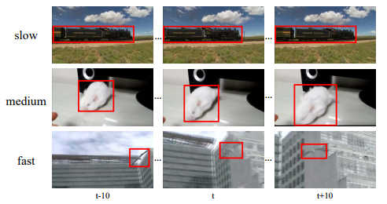

# Flow-Guided Feature Aggregation for Video Object Detection


This repository is implemented by [Yuqing Zhu](https://github.com/jeremy43), [Shuhao Fu](https://github.com/howardmumu), and [Xizhou Zhu](https://github.com/einsiedler0408), when they are interns at MSRA.

## Introduction


**Flow-Guided Feature Aggregation (FGFA)** is initially described in an [ICCV 2017 paper](https://arxiv.org/abs/1703.10025). It provides an accurate and end-to-end learning framework for video object detection. The proposed FGFA method, together with our previous work of [Deep Feature Flow](https://github.com/msracver/Deep-Feature-Flow), powered the winning entry of [ImageNet VID 2017](http://image-net.org/challenges/LSVRC/2017/results). It is worth noting that:

* FGFA improves the per-frame features by aggregating nearby frame features along the motion paths. It significantly improves the object detection accuracy in videos, especially for fast moving objects.
* FGFA is end-to-end trainable for the task of video object detection, which is vital for improving the recognition accuracy.
* We proposed to evaluate the detection accuracy for slow, medium and fast moving objects respectively, for better understanding and analysis of video object detection. The [motion-specific evaluation code](lib/dataset/imagenet_vid_eval_motion.py) is included in this repository.

***Click image to watch our demo video***

[](https://www.youtube.com/watch?v=R2h3DbTPvVg)

***Example object instances with slow, medium and fast motions***



## Disclaimer

This is an official implementation for [Flow-Guided Feature Aggregation for Video Recognition](https://arxiv.org/abs/1703.10025) (FGFA) based on MXNet. It is worth noticing that:

  * The original implementation is based on our internal Caffe version on Windows. There are slight differences in the final accuracy and running time due to the plenty details in platform switch.
  * One-phase training is performed on the mixture of ImageNet DET+VID, instead of two-phase training as in the original paper (on ImageNet DET first, followed by ImageNet VID).
  * The code is tested on official [MXNet@(v0.10.0)](https://github.com/apache/incubator-mxnet/tree/v0.10.0) with the extra operators for Flow-guided Feature Aggregation.
  * We trained our model based on the ImageNet pre-trained [ResNet-v1-101](https://github.com/KaimingHe/deep-residual-networks) model and [Flying Chairs](https://lmb.informatik.uni-freiburg.de/resources/datasets/FlyingChairs.en.html) pre-trained [FlowNet](https://lmb.informatik.uni-freiburg.de/resources/binaries/dispflownet/dispflownet-release-1.2.tar.gz) model using a [model converter](https://github.com/dmlc/mxnet/tree/430ea7bfbbda67d993996d81c7fd44d3a20ef846/tools/caffe_converter). The converted [ResNet-v1-101](https://github.com/KaimingHe/deep-residual-networks) model produces slightly lower accuracy (Top-1 Error on ImageNet val: 24.0% v.s. 23.6%).
  * This repository used code from [MXNet rcnn example](https://github.com/apache/incubator-mxnet/tree/master/example/rcnn) and [mx-rfcn](https://github.com/giorking/mx-rfcn).


## License

© Microsoft, 2017. Licensed under the [MIT](LICENSE) License.

## Citing Flow-Guided Feature Aggregation

If you find Flow-Guided Feature Aggregation useful in your research, please consider citing:
```
@inproceedings{zhu17fgfa,
    Author = {Xizhou Zhu, Yujie Wang, Jifeng Dai, Lu Yuan, Yichen Wei},
    Title = {Flow-Guided Feature Aggregation for Video Object Detection},
    Conference = {ICCV},
    Year = {2017}
}

@inproceedings{dai16rfcn,
    Author = {Jifeng Dai, Yi Li, Kaiming He, Jian Sun},
    Title = {{R-FCN}: Object Detection via Region-based Fully Convolutional Networks},
    Conference = {NIPS},
    Year = {2016}
}
```

## Main Results


|                                 | <sub>training data</sub>     | <sub>testing data</sub> | <sub>mAP(%)</sub> | <sub>mAP(%)</br>(slow)</sub>  | <sub>mAP(%)</br>(medium)</sub> | <sub>mAP(%)</br>(fast)</sub> |
|---------------------------------|-------------------|--------------|---------|---------|--------|--------|
| <sub>Single-frame baseline</br>(R-FCN, ResNet-v1-101)</sub>   | <sub>ImageNet DET train</br> + VID train</sub> | <sub>ImageNet VID validation</sub> | 74.1 | 83.6 | 71.6 | 51.2 |
| <sub>FGFA</br>(R-FCN, ResNet-v1-101, FlowNet)</sub>           | <sub>ImageNet DET train</br> + VID train</sub> | <sub>ImageNet VID validation</sub> | 77.1 | 85.9 | 75.7 | 56.1 |
| <sub>FGFA + SeqNMS</br>(R-FCN, ResNet-v1-101, FlowNet)</sub>  | <sub>ImageNet DET train</br> + VID train</sub> | <sub>ImageNet VID validation</sub> | 78.9 | 86.8 | 77.9 | 57.9 |


*Detection accuracy of slow (motion IoU > 0.9), medium (0.7 ≤ motion IoU ≤ 0.9), and fast (motion IoU < 0.7) moving object instances.*

**[Motion-specific evaluation code](lib/dataset/imagenet_vid_eval_motion.py) is available!**


## Requirements: Software

1. MXNet from [the offical repository](https://github.com/apache/incubator-mxnet). We tested our code on [MXNet@(v0.10.0)](https://github.com/apache/incubator-mxnet/tree/v0.10.0). Due to the rapid development of MXNet, it is recommended to checkout this version if you encounter any issues. We may maintain this repository periodically if MXNet adds important feature in future release.

2. Python packages might missing: cython, opencv-python >= 3.2.0, easydict. If `pip` is set up on your system, those packages should be able to be fetched and installed by running
	```
	pip install Cython
	pip install opencv-python==3.2.0.6
	pip install easydict==1.6
	```
3. For Windows users, Visual Studio 2015 is needed to compile cython module.


## Requirements: Hardware

Any NVIDIA GPUs with at least 8GB memory should be OK.

## Installation

1. Clone the Flow-Guided Feature Aggregation repository, and we call the directory that you cloned as ${FGFA_ROOT}.

~~~
git clone https://github.com/msracver/Flow-Guided-Feature-Aggregation.git
~~~
2. For Windows users, run ``cmd .\init.bat``. For Linux user, run `sh ./init.sh`. The scripts will build cython module automatically and create some folders.

3. Install MXNet:

	3.1 Clone MXNet and checkout to [MXNet@(v0.10.0)](https://github.com/apache/incubator-mxnet/tree/v0.10.0) by
	```
	git clone --recursive https://github.com/apache/incubator-mxnet.git
	cd incubator-mxnet
	git checkout v0.10.0
	git submodule update
	```
	3.2 Copy operators in `$(FGFA_ROOT)/fgfa_rfcn/operator_cxx` to `$(YOUR_MXNET_FOLDER)/src/operator/contrib` by
	```
	cp -r $(FGFA_ROOT)/fgfa_rfcn/operator_cxx/* $(MXNET_ROOT)/src/operator/contrib/
	```
	3.3 Compile MXNet
	```
	cd ${MXNET_ROOT}
	make -j4
	```
	3.4 Install the MXNet Python binding by

	***Note: If you will actively switch between different versions of MXNet, please follow 3.5 instead of 3.4***
	```
	cd python
	sudo python setup.py install
	```
	3.5 For advanced users, you may put your Python packge into `./external/mxnet/$(YOUR_MXNET_PACKAGE)`, and modify `MXNET_VERSION` in `./experiments/fgfa_rfcn/cfgs/*.yaml` to `$(YOUR_MXNET_PACKAGE)`. Thus you can switch among different versions of MXNet quickly.


## Demo


1. To run the demo with our trained model (on ImageNet DET + VID train), please download the model manually from [OneDrive](https://1drv.ms/u/s!AqfHNsil2nOiiwDiKev7DB6L9ay7), and put it under folder `model/`.

	Make sure it looks like this:
	```
	./model/rfcn_fgfa_flownet_vid-0000.params
	```
2. Run
	```
	python ./fgfa_rfcn/demo.py
	```

## Preparation for Training & Testing

1. Please download ILSVRC2015 DET and ILSVRC2015 VID dataset, and make sure it looks like this:

	```
	./data/ILSVRC2015/
	./data/ILSVRC2015/Annotations/DET
	./data/ILSVRC2015/Annotations/VID
	./data/ILSVRC2015/Data/DET
	./data/ILSVRC2015/Data/VID
	./data/ILSVRC2015/ImageSets
	```

2. Please download ImageNet pre-trained ResNet-v1-101 model and Flying-Chairs pre-trained FlowNet model manually from [OneDrive](https://1drv.ms/u/s!Am-5JzdW2XHzhqMOBdCBiNaKbcjPrA), and put it under folder `./model`. Make sure it looks like this:
	```
	./model/pretrained_model/resnet_v1_101-0000.params
	./model/pretrained_model/flownet-0000.params
	```

## Usage

1. All of our experiment settings (GPU #, dataset, etc.) are kept in yaml config files at folder `./experiments/fgfa_rfcn/cfgs`.

2. Two config files have been provided so far, namely, frame baseline (R-FCN) and the proposed FGFA  for ImageNet VID. We use 4 GPUs to train models on ImageNet VID.

3. To perform experiments, run the python script with the corresponding config file as input. For example, to train and test FGFA with R-FCN, use the following command
    ```
    python experiments/fgfa_rfcn/fgfa_rfcn_end2end_train_test.py --cfg experiments/fgfa_rfcn/cfgs/resnet_v1_101_flownet_imagenet_vid_rfcn_end2end_ohem.yaml
    ```
	A cache folder would be created automatically to save the model and the log under `output/fgfa_rfcn/imagenet_vid/`.

4. Please find more details in config files and in our code.

## Misc.

Code has been tested under:

- Windows Server 2012 R2 with 4 K40 GPUs and Intel Xeon CPU E5-2650 v2 @ 2.60GHz
- Windows Server 2012 R2 with 2 Pascal Titan X GPUs and Intel Xeon CPU E5-2670 v2 @ 2.50GHz

## FAQ
Q: I encounter `segment fault` at the beginning.

A: A compatibility issue has been identified between MXNet and opencv-python 3.0+. We suggest that you always `import cv2` first before `import mxnet` in the entry script. 

<br/><br/>
Q: I find the training speed becomes slower when training for a long time.

A: It has been identified that MXNet on Windows has this problem. So we recommend to run this program on Linux. You could also stop it and resume the training process to regain the training speed if you encounter this problem.

<br/><br/>
Q: Can you share your caffe implementation?

A: Due to several reasons (code is based on a old, internal Caffe, port to public Caffe needs extra work, time limit, etc.). We do not plan to release our Caffe code. Since a warping layer is easy to implement, anyone who wish to do it is welcome to make a pull request.
